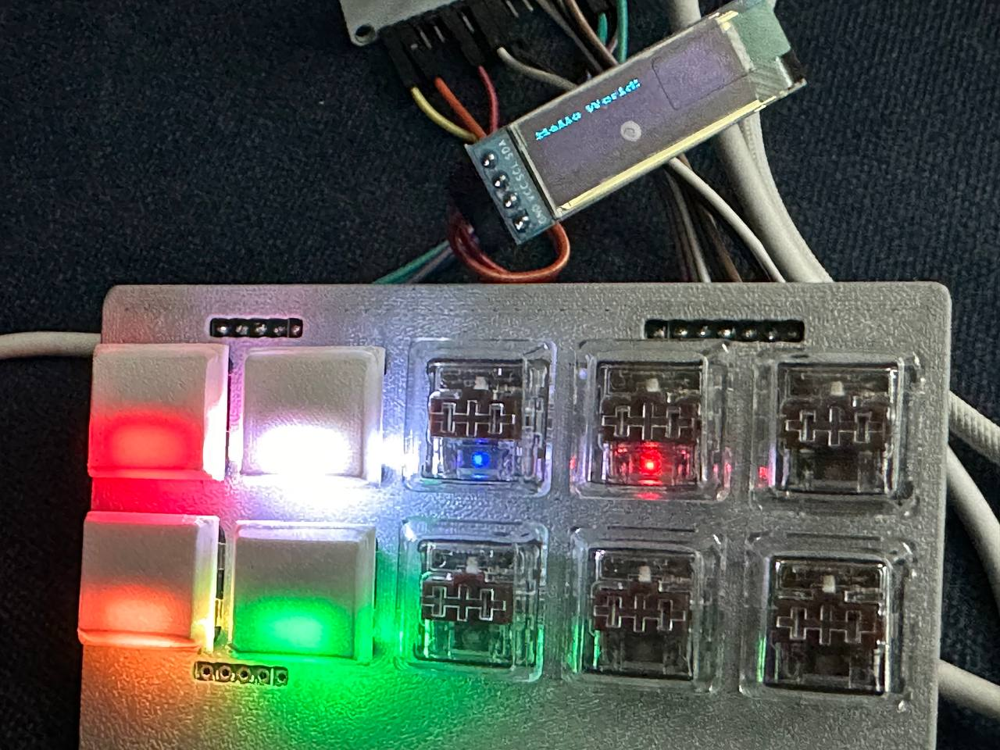
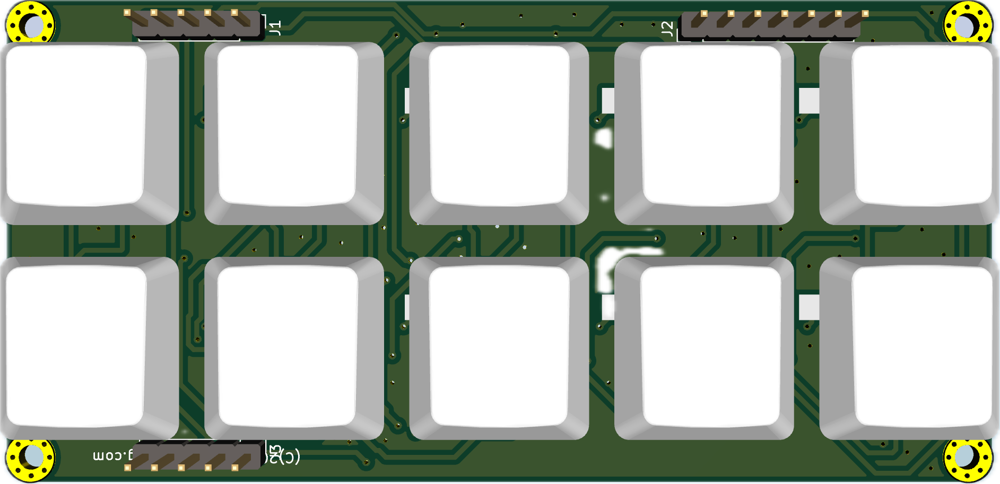
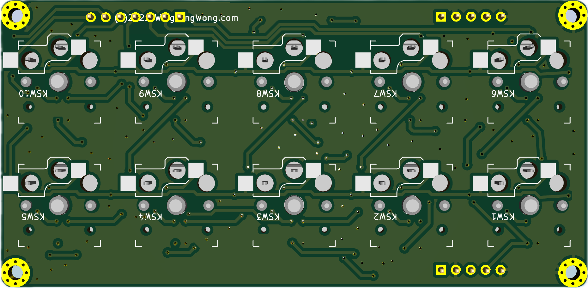

# Simple Board

## Images

### Photo of Simple Board with PETG printed faceplate and low profile clear keycaps and frosted white PETG keycaps

### KiCad 3D Renders

## PCB Parts

* PCB Design Produced Through JLCPCB
* Kailh Chocolate Low Profile Key Sockets
* SMD WS2812 RGB LED
* SMD Diodes

## Keyswitch Parts
* Kailh Chocolate Low Profile Keys
* Transparent Low Profile Keycaps

## 3D Printed Parts

* PETG 3D Printed Low Profile Keycaps
* PETG 3D Printed Faceplate

